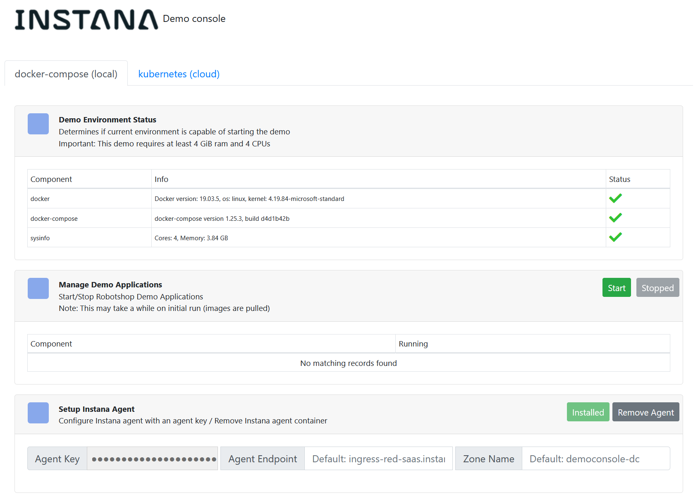

# Instana Demo Console


This self-contained application will automate the process of deploying and configuring the Instana Agent, Robot Shop, and Load Generator on your local machine and against an existing Kubernetes cluster (admin credentials must be supplied via kubeconfig yaml bundle). The agent installer uses the Instana static agent to expedite the auto-instrumentation process.

Authors:

* Sangho Park - <sangho@instana.com>
* Kevin Crawley - <kevin.crawley@instana.com>

## Prerequisites
* docker
* kubeconfig bundle (for kubernetes demo functionality)

This application is entirely self-contained, and should work on all platforms.

### Ensure your machine has Docker installed
* OSX - https://docs.docker.com/docker-for-mac/install/
* Windows - https://docs.docker.com/docker-for-windows/install/
* Linux (ubuntu) - https://docs.docker.com/install/linux/docker-ce/ubuntu/

### Start the application

`$ make service`

If you are not using a posix shell (you should be), you can start the application without `make`:

```
docker run \
  -d --rm \
  --name demo-bootstrapper \
  --volume config:/config \
  --volume /var/run/docker.sock:/var/run/docker.sock \
  --privileged \
  -p 8081:80 \
  kcmastrpc/democonsole:latest
```

Access the service locally in your browser at [http://localhost:8081](http://localhost:8081)

### View logs

`$ make log`

### Other commands (building/development tools)

`$ make help`

## Docker Guide (local)

No installation or configuration should be necessary, the container comes with all necessary dependencies installed.

## Kubernetes Guide (cloud)

A properly configured kubernetes cluster is required to utilize this portion of the demo.

> Note: Additional guides should be created for other K8S platforms (OpenShift, AKS, EKS, etc)

### Setup
* Follow [this guide](https://gitlab.com/opentracing-workshop/lab-notes) for instructions on how to setup a cluster and export a valid kubeconfig file.
* Complete [Lab 01](https://gitlab.com/opentracing-workshop/lab-notes/tree/master/lab-01#welcome-to-lab-01-google-cloud-sign-up) and up to the end of [Lab 02 - Section 1.4](https://gitlab.com/opentracing-workshop/lab-notes/tree/master/lab-02#welcome-to-lab-02-kubernetes-setup) to generate a kubeconfig file on Google Cloud (GKE)
* Use the `kubeconfig` file generated above to configure the kubernetes demo console